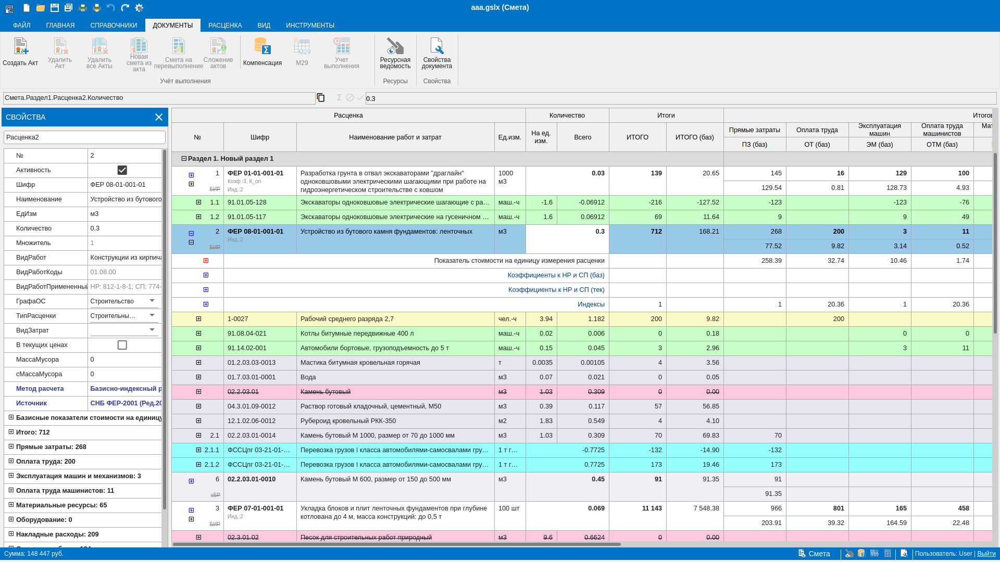
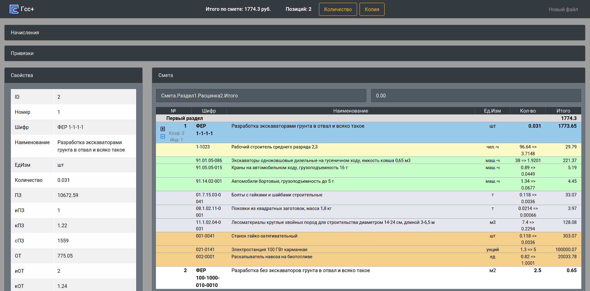
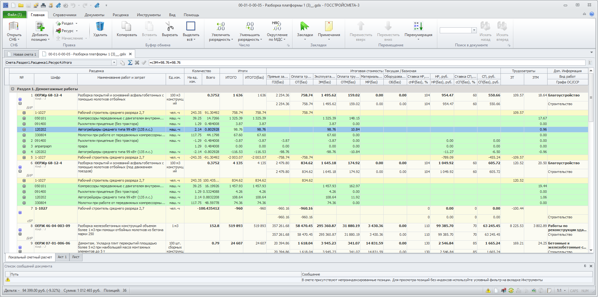
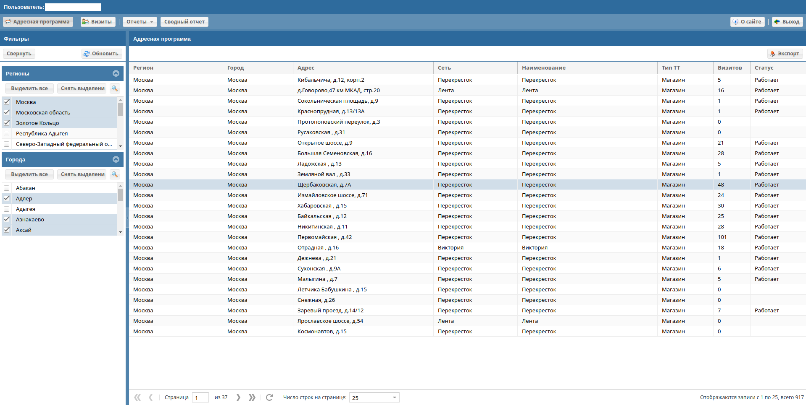
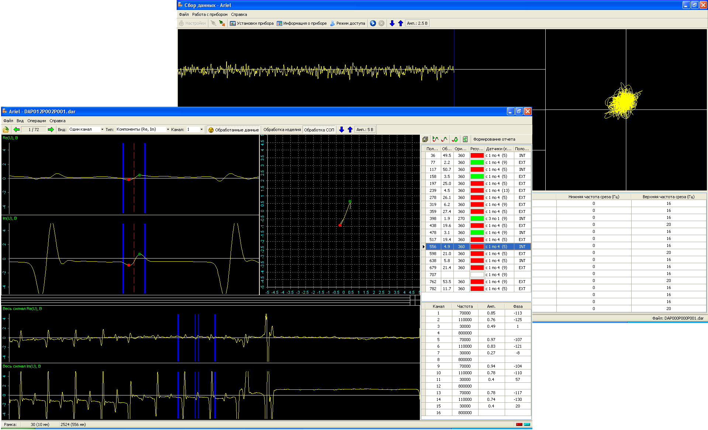
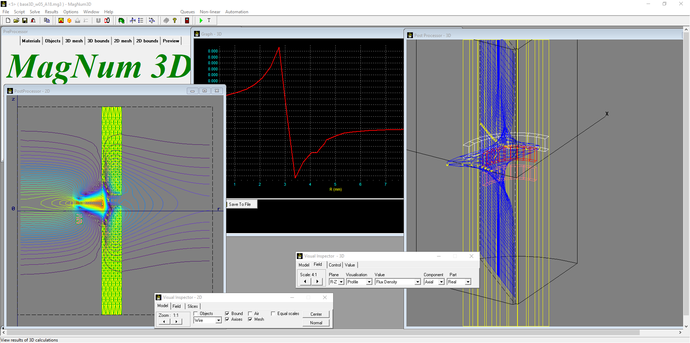

## Обо мне

Я разработчик настольных и интернет приложений ([резюме](./RESUME.MD)).

Веду здоровый образ жизни, занимаюсь спортом, не приемлю курение и алкоголь.

Ценю в людях честность по отношению к окружающим и себе.

#### По жизни увлекаюсь следующими вещами:

- программирование
- садоводство
- велосипед
- электроника
- столярка
- бег

## Мои проекты

### WebSmeta

Полноценная локальная смета в вебе

Распределенное сетевое веб-приложение для составления локальных смет со множеством возможностей

#### Характеристики

- Работа с СНБ
- Коэффициенты, индексы, начисления
- Все поля задаются формулами
- Возможено многопользовательская работа с документом
- Создание актов, компенсаций, М-29
- Копирование и вставка
- И многое другое

#### Ссылки

- [Сайт](https://gss-online.ru)
- [Компания](https://gosstroysmeta.ru)

---

### GSmeta

Пример расчета сметы в web

Это приложение было создано как пример, чтобы оценить возможности React для построения полнофункционального сметного приложения в web.

#### Характеристики

- Изменение количества по раценке
- Копирование и вставка выбранного элемента
- Просмотр дополнительной информации по выбранному элементу
- Сворачивание и разворачивание расценок для просмотра дополнительной детализациии

#### Ссылки

- [gsmeta - репозиторий в github](https://github.com/zag82/gsmeta)

---

### Gosstroysmeta

Приложение для составления сметной документации

Это приложение я писал на своей основной работе в команде разработчиков. Программа позволяет рассчитывать сметы, применять индексы, поправочные коэффициенты. Написана на Delphi.

#### Характеристики

- Собственный расчетный движок с формулами и ссылками на различные элементы. Возможность использовать агрегатные функции при расчете
- Скрипты для дополнения функционала программы
- Работа с базами сметных нормативов
- Применение индексов и коэффициентов
- И многое другое, что важно для сметчика

#### Ссылки

- [Сайт компании](https://gosstroysmeta.ru)

---

### Promo

Веб проекты для promo-software.com

Это набор сайтов для BTL-рекламы по сбору данных мерчендайзерами. Проекты выполнены на собственном движке на php, фронтэнд - ExtJS 4.2.

#### Характеристики

- Отображение списка адресов
- Отображение детализации по визитам в конкретный адрес
- Список визитов
- Детализация визита с отобаржением всех собранных данных, фото и аудио материалов
- Отчеты в виде таблиц и графиков по различным срезам
- Все отчеты и списки можно фильтровать. некоторые фильтры имеют множественный выбор и собственную строку поиска
- Сводные таблицы данных
- Экспорт в Эксель всех списков с учетом фильтров
- Возможность добавления уникальных отчетов для конкретного проекта

---

### Ariel

Программа получения и обработки вихретоковых сигналов с прибора PL500

Программа позволяет подключаться к вихретоковому прибору Rohman PL500 и сохранять данные вихретоковых сигналов в файл. Второе приложение позволяет просмоатривать и анализировать полученные сигналы. Программа написана на Delphi и обладает высокой скоростью обработки данных и отображения сигналов.

#### Характеристики

- Работа с прибором PL500
- Задание параметров для 16 вихретоковых каналов: возбуждение, частота, фильтры, усиление, компенсация и т.д.
- Автоматическое включение записи при поднесении датчиков к объекту контроля и автоматическое сохранение файла при окончании контроля (позволяет наладить потоковый контроль без участия оператора)
- Анализ сигналов и обнаружение дефектов
- Автоматическое определение размеров дефекта
- Ручной анализ сигналов
- Скриптовой модуль для автоматизации анализа и обработки данных

#### Ссылки

- [ariel - репозиторий в github](https://github.com/zag82/ariel)

---

### MagNum3D

Программа конечно-элементного моделирования

Программа конечно-элементного моделирования распределения электромагнитных полей. Создавалась мной еще в институте, будучи студентом. Позволяет рассчитывать плоские, осесимметричные и трехмерные распределения полей. Конечно-элементная сетка квази-регулярная, то есть может сжиматься и расширяться. Программа написана на Delphi и очень быстро решает задачи.

#### Характеристики

- Решаемые задачи: электростатика, электростатика с векторным потенциалом, статическое магнитное поле, гармоническое электромагнитное поле
- Построение сеточных моделей на плоскости и в пространстве
- Расчет двумерной и 3х-мерной задачи на одной модели
- Просмотр результатов: силовые линии, изолинии, поверхность распределения
- Отображение графиков распределения величины вдоль заданного направления
- Расчет потенциалов, плотности потока
- Учет кривой намагничивания для магнитных материалов

#### Ссылки

- [magnum3d - репозиторий в github](https://github.com/zag82/magnum3d)
