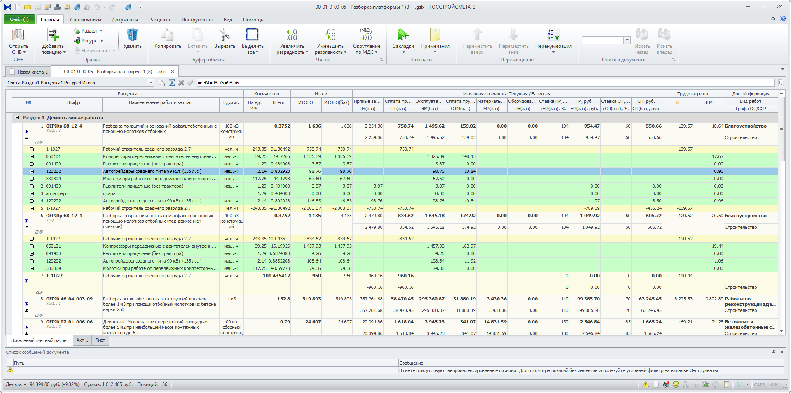
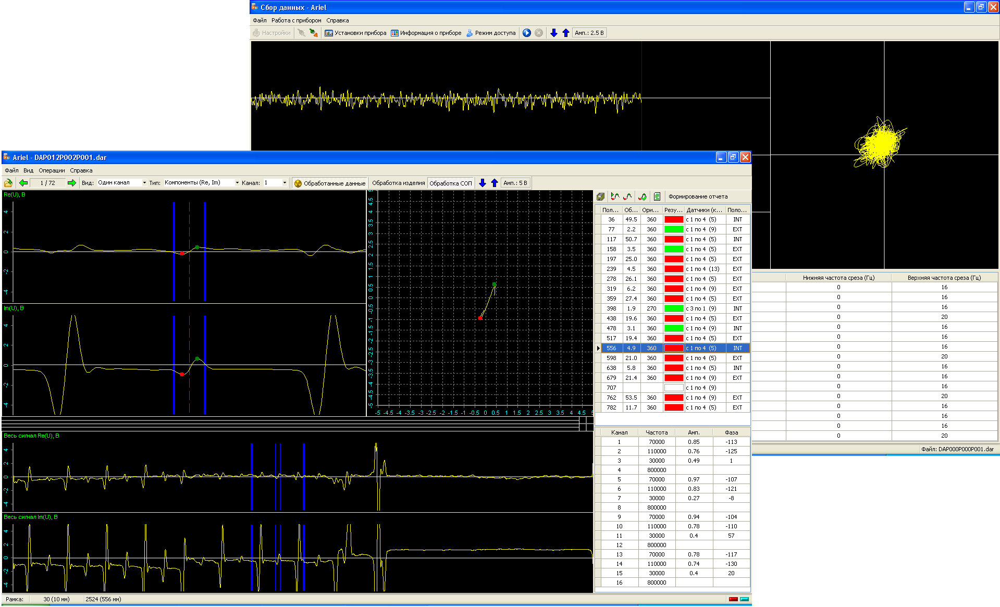
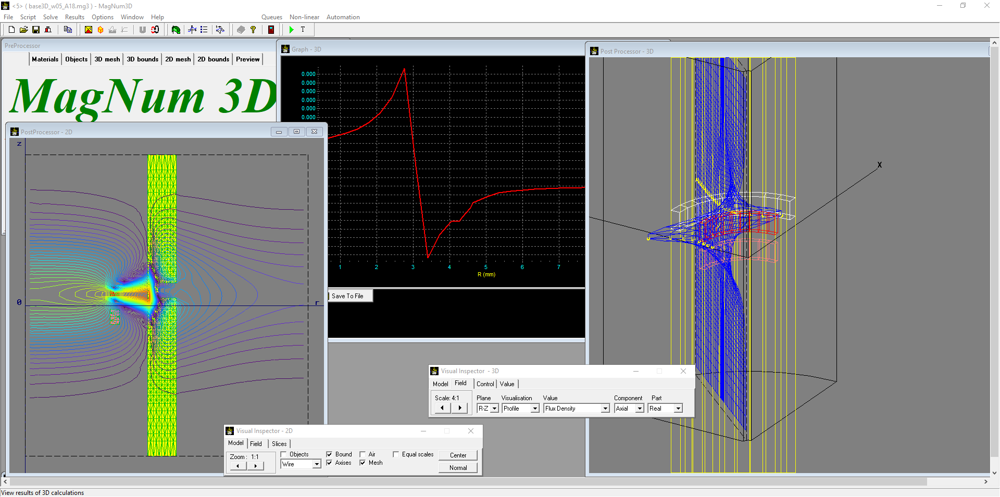

## About me

I am application developer for web and desktop ([resume](./RESUME_en.MD)).

I prefer healthy life full of sport activities without smoking and alcohol.

My preference in life is to be honest with people and myself.

#### My hobbies and activities:

- coding
- gardening
- cycling
- electronics
- work-with-wood
- running

## My projects

### WebSmeta

Huge enterprise web app for local estimate

Distributed web-application for local estimates creation having lots of features and possibilities for user

#### Features

- Work with estimates databases
- Coefficients, indices and total additions
- Formula calculations for any field
- Multiple users can edit document simutaneously
- Acts creation, compensation, M-29 form
- Copy & paste and many more...

#### Links

- [Site](https://gss-online.ru)
- [Company](https://gosstroysmeta.ru)

---

### GSmeta

Sample web application to show estimate calculations

This application was made as a sample to show React possibilities to make fully functional estimates application on web.

#### Features

- Change cost quantity
- Copy and paste any selected item
- View extended properties on eny selected item
- Collapse and expand cost additional information

#### Links

- [gsmeta - github repo](https://github.com/zag82/gsmeta)

---

### Gosstroysmeta

Desktop office application for construction estimates

This application was written at my full time job in team of developers. Program calculates estimates, apply indexes and coefficients. It is written on Delphi.

#### Features

- Calculation engine with formulas and links between parts of document. Aggregate functions, that can be used in formulas
- Script engine to expand program functionality
- Work with cost databases
- Apply indexes and coefficients
- And more, that cost engineers need...

#### Links

- [Company site](https://gosstroysmeta.ru)

---

### Promo

Web projects for promo-software.com

Several sites for BTL advertisement to present data from merchandizers. All sites are made on php using self-made original framework, frontend is build using ExtJS 4.2.

#### Features

- Address book
- Each addres details to show visits
- Visits to all points
- Visit details with all collected data, photo and audio
- Report in table view and charts for various cases
- All reports and pages can be filtered. Some filters allow multiselect and inplace search features
- Summarized tables
- All reports and pages Excel export according to filters applied
- Ability to add custom reports for particular project

---

### Ariel

Program for acquiring and processing eddy current signals from PL500 device

Program allows you to connect to Rohman PL500 eddy current testing device and store eddy current testing data to files. Scecond application allows to view and analyse signals acquired. Program is written on Delphi and has high data processing and signal manipulations speed.

#### Features

- Works with Rohman PL500 eddy current device
- Set paramenters for 16 eddy current channels: drive, frequency, filtering, compensation etc.
- Automatic record start when probes enters inspected object. Automatic file saving when probes leaves inspected object. All of this is for no operatpr inspections
- Signal analysis and defects recognition
- Automatic defect parameters estimation
- Manual signal analysis
- Scripting module for data processing automation

#### Links

- [ariel - github repo](https://github.com/zag82/ariel)

---

### MagNum3D

Finite elements method modelling program

This finite elements method modelling program allows calculate electromagnetic fields distributions. It was created by me during studying in institute when I was a student. It allows to solve plane, axisymmetrical and 3d electromagnetic tasks. Finnite elements mesh is semi-regular, because it can be expanded and squeezed at several areas. Program was written in Delphi and it is very fast in solving tasks.

#### Features

- Tasks: electrostatic, steady state and eddy currents
- Mesh models for planes and in volume
- One model for 2D and 3D tasks calculations
- Post processing: vector field, force lines, surface of values, equipotential lines
- Plots for field values distribution along specified direction
- Calculations of potentials, flux dencity, intencity
- Calculations on magnetic curve for ferromagnetic materials

#### Links

- [magnum3d - github repo](https://github.com/zag82/magnum3d)
